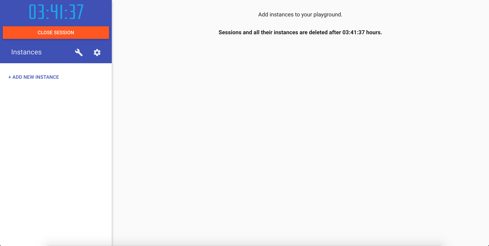
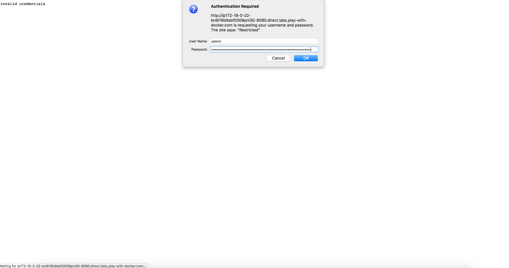
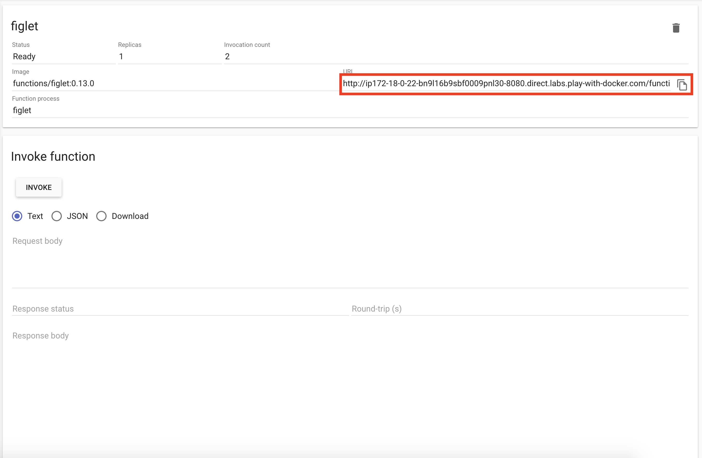

# OpenFaas Serverless Functions

Now that we understand how to package and deploy containers.  Let's explore the world of containers running at scale. OpenFaas is an open-source framework that allows us to package single functions into a container and have them run at incredible scale.

## Install OpenFaas

Start with no instances.  If any instances exist you should delete them



Click on the "wrench" icon and create a new swarm with with 1 manager and 1 worker node.


Deploy an OpenFaas stack by running the following command on the manager1 terminal.

```bash
git clone https://github.com/openfaas/faas && \
  cd faas && \
  ./deploy_stack.sh
```

Copy the generated admin password in the console. 


Open port `8080`.  You will be presented with a basic authorization dialog.  Enter username: admin and paste the password that you copied from the previous step




You should now see the OpenFaas Dashbord.


## Deploy Figlet

Deploy the Figlet function by clicking `Deploy New Function`.  Then select Figlet and the deploy button.


Congratualations!  You've deployed your first serverless function.


Test out your function, copy the url of your new function.



## Deploy Curl

To test out our figlet function we are going to use another function.  Let's deploy a new function called `curl`.


This function will allow us to run a curl command right from our browser! Let's use this function to call our figlet function.

Click on the `curl` function.

In the `Request body` field enter the following curl command.
- replace `USERNAME` with your github username.
- replace `FIGLET_URL` with the figlet url that you copied in the previous step.

```bash
curl -d "USERNAME" FIGLET_URL
```


## Invoke the function

Click on the `invoke` button to run the curl command from your browser.  You should see the request execute, along with the output from the figlet function.


Congratulations, you've create ascii art!

## Main Takeaways

- Containers can contain individual functions called functions as a service (FaaS)
- FaaS containers are like microservices to the extreme. Singe input output.
- We can chain as many of these together as we want to build sophisticated systems.
- Think of the Alexa example.